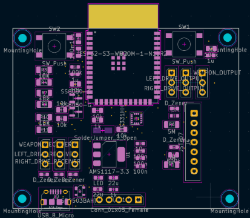
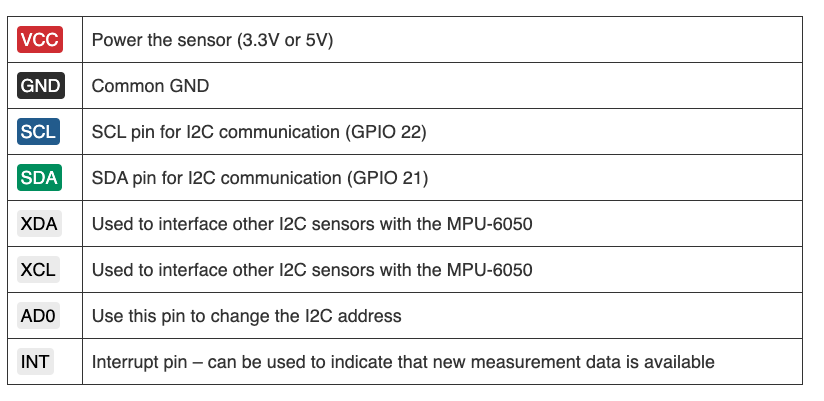
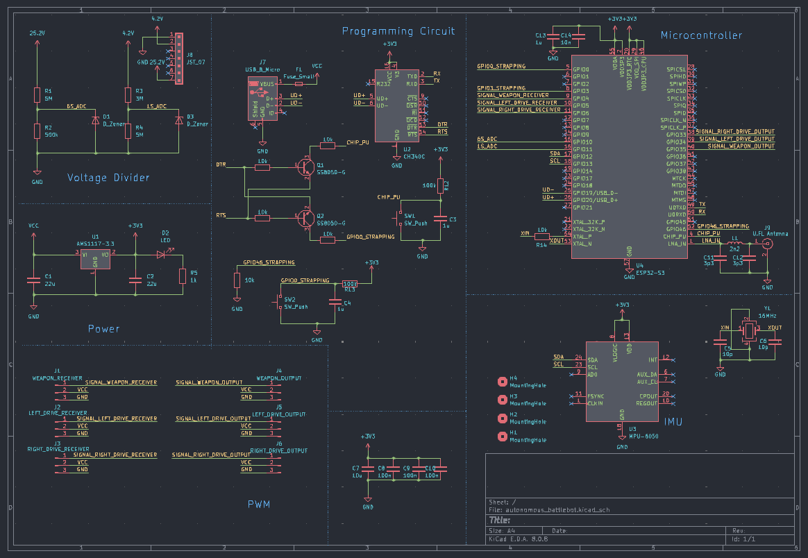
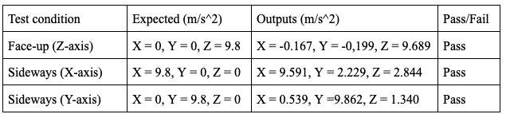
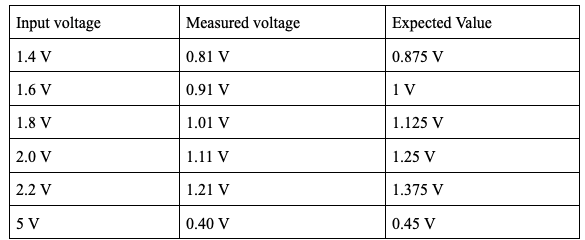
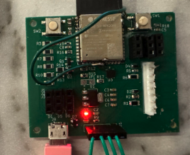

# Date: Week of 2/3
https://www.espressif.com/en/products/socs/esp32
https://docs.espressif.com/projects/esp-idf/en/v4.4/esp32s3/api-reference/peripherals/gpio.html
The ESP32 is a low-cost, low-power system on a chip (SoC) with integrated Wi-Fi and Bluetooth, widely used in embedded systems and Internet of Things (IoT) projects. It’s developed by Espressif Systems, a company based in Shanghai.

Key Features:
Dual-core Tensilica Xtensa LX6 (or single-core in some variants)
Wi-Fi (802.11 b/g/n) and Bluetooth 4.2 / BLE
Up to 520 KB SRAM and support for external flash
GPIOs, ADC, DAC, UART, SPI, I2C, PWM, and more
Ultra-low power modes for battery-powered applications
Integrated Hall sensor and temperature sensor

ESP32 can be interfaced with other systems to provide WiFi and Bluetooth functionality through SPI / SDIO or I2C / UART interfaces. 

# Date: Week of 2/10
MPU6050 for acceleration data
6-axis MEMS motion tracking device developed by InvenSense (now part of TDK). It combines a 3-axis gyroscope and a 3-axis accelerometer in a single chip, making it ideal for motion-sensing and orientation-tracking applications.
6 Degrees of Freedom (DoF):
3-axis accelerometer (±2g, ±4g, ±8g, ±16g)
3-axis gyroscope (±250, ±500, ±1000, ±2000 °/sec)
Digital Motion Processor (DMP):
Onboard processor that can compute complex motion processing algorithms (e.g., sensor fusion) internally, reducing the load on the main microcontroller.
I²C and SPI communication support
16-bit ADCs for each axis (high resolution)
Power supply: 2.3V–3.4V (typically 3.3V)

Accelerometer: Measures linear acceleration (e.g., gravity, movement).
Gyroscope: Measures angular velocity (rotation rate).
Temperature sensor: Provides die temperature reading (useful for compensation).

# Date: Week of 2/17
Mostly preparing for proposal review and get started with the PCB

# Date: Week of 2/24
Attached a schematic of our PCB 

Following is the MPU6050 Pinout

Following is the schematic

After TA meeting and PCB review, everything looks good and I will ordering all the parts.
Update: Order has been done over the weekend.

# Date: Week of 3/3
PCB order has been gone through.
Waiting for the parts to arrive so we can start assembling.
Start working on the design document and start preparing for the breadboard demonstration.

For breadboard demo, we will be showing the AprilTag conversion and basic ESP32 board demonstration using Arduino IDE to test out the acceleration.
https://randomnerdtutorials.com/esp32-mpu-6050-accelerometer-gyroscope-arduino/
Will be using this tutorial as reference
Uploaded the acceleration.ino for demo

# Date: Week of 3/10
Completed the breadboard demo
Double-check the connection with Bluetooth
- Doesn't work that well.. Maybe WiFi?
Not much work done with the parts yet

# Date: Week of 3/17
Spring Break

# Date: Week of 3/24
Missed TA meeting due to midterm
Work on individual progress reports
Placed all the orders for PCB

Update: IMU CHANGE 
Changes with IMU as MPU6050 is no longer available
Will be using LIS331

https://mm.digikey.com/Volume0/opasdata/d220001/medias/docus/2319/LIS331DLH%28TR%29.pdf?_gl=1*o3cct9*_up*MQ..*_gs*MQ..&gclid=EAIaIQobChMIkJbii_mSjQMV421_AB3LKxUXEAYYASABEgI4ePD_BwE&gclsrc=aw.ds&gbraid=0AAAAADrbLljJzxJzK2U1m1CAs5TZZUbq0
LIS331 IMU for acceleration data
3-axis MEMS accelerometers developed by STMicroelectronics, designed to measure acceleration in three dimensions (X, Y, and Z). It's often used in applications like motion sensing, gesture recognition, tilt detection, and vibration monitoring.

Key Features (for LIS331DLH, a common variant):
Measurement Range: ±2g / ±4g / ±8g (selectable)
Resolution: 12-bit or higher
Communication Interfaces:
I²C
SPI
Low power consumption, suitable for battery-operated devices
Embedded functions:
Free-fall detection
Tap/double-tap recognition
Click and activity detection

https://www.st.com/resource/en/datasheet/lis331dlh.pdf

# Date: Week of 3/31
Finish up individual progress report
Robobrawl competition is coming up.. We won't be able to work on the robot over the weekend due to the competition
Still waiting for the PCB parts to arrive

# Date: Week of 4/7
Started assembling and soldering the parts as everything arrived
Need more diodes and resistors
Also realized that we should be using a different ESP32 module 

# Date: Week of 4/14  
Reordered all the necessary parts we need
Also need to order stencil as the PCB is too small to solder without a stencil
We also did not have enough solder paste so we ordered extra solder paste

# Date: Week of 4/21
Prepare for mock demo

PCB is not ready due to the parts still arriving (Stencil is stuck in customs)
Only would be showing the software parts
- AprilTag detections
- Robot following along the RC car

# Date: Week of 4/28
Prepare for final demo, mock presentation, and extra credit video

We had our PCB working, have gone through voltage divider test and IMU acceleration test.
Video for the following test:
IMU video was too large and exceeded the file size limit. The table is still provided below.

The results were the following.

For the voltage divider test, the expected value will use the following formula: Vout = (Vin × R2 ) /(R1 + R2)

Our final PCB looks like the following:

Unfortunately, we were only able to have output in the serial monitor and was not able to upload anything
-Possible soldering issue with the RX pin
-Not enough time to fix the PCB

# Date: Week of 5/5
Work on final presentation and paper